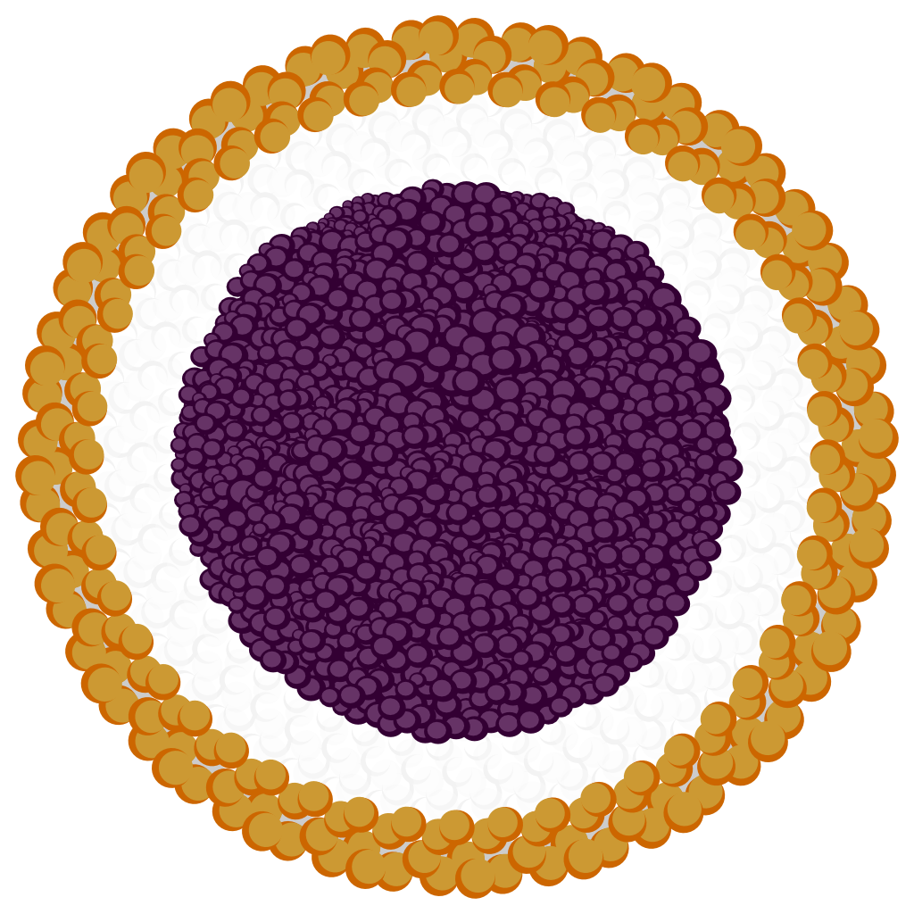

<div align="center">

</div>

# DeUI: Declarative UI Wrapper Framework for Pure Python

> Declare User Interface by Pure Python Code.
> 

## Motivation

1. Write pure Python code to declare User Interface, instead of using external layout file
2. Give a flexible and efficient way to wrap existing UI frameworks
3. Allow any users, including corporations, to use this framework both for OSS and proprietary projects

## Solutions

1. Use `with` statement to bind view context

    ```python
    class RootComponent(ViewComponent):
        def body():
            with MainView(some_parameter=1.0):
                # Conditional layouts can be declared with pure Python code
                if some_state == SomeState.pattern_A:
                    with SomeComponent():
                        SomeView()
                else:
                    with AnotherComponent():
                        AnotherView()
    ```

2. Use `__new__` definitions to separate view hierarchies and actual widgets

    ```python
    instance = SomeWidget()
    
    print(isinstance(instance, Widget))
    # -> False
    print(isinstance(instance, View))
    # -> True
    
    # actual widget is created by lazy evaluation when needed.
    print(isinstance(instance.get_initial_widget(), Widget))
    # -> True
    ```

3. Release core components under MIT license, and give a room for choice of actual UI frameworks for implementation

## Roadmaps

- [x] render widgets by updating only changed parts of the view hierarchy
- [ ] thread-safe view context binding
- [ ] bind properties and states of actual widgets
- [ ] provide wraps for existing UI frameworks

## Misc

- DeUI is, of course, the shortened name of **De**clarative **UI**.
  
    The logo is inspired by Chinese sweets Jin Deui, which is sesame-coated and fried rice cake wrapping lotus,
    black bean, or red bean paste.
  
